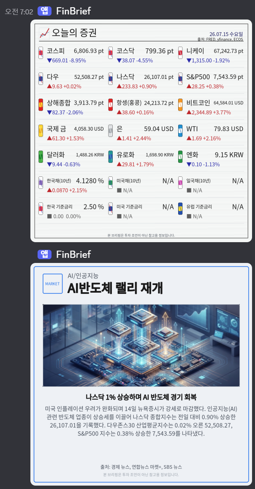
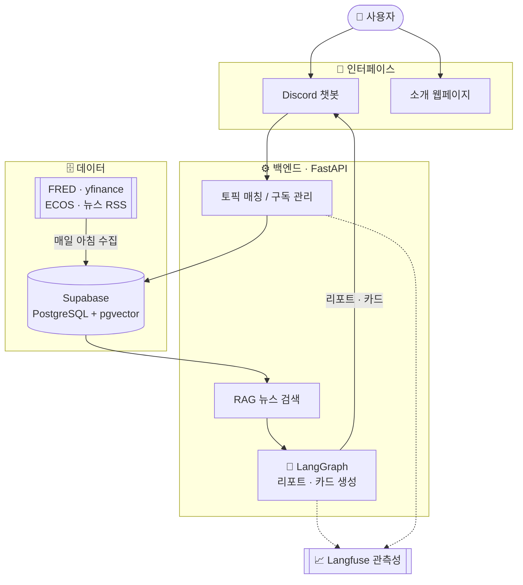

<div align="center">


# FinBrief 📊

**관심 있는 금융 토픽만 골라, 매일 아침 AI 브리핑으로 받아보세요**

관심 금융 토픽을 구독하면, 실제 시장 지표와 최신 경제 뉴스를 종합해<br/>
매일 아침 **Discord**로 리포트와 카드뉴스를 전달하는 AI 금융 브리핑 서비스입니다.


<br/>

[🌐 소개 웹페이지](http://34.50.41.2:8000/) · [🤖 디스코드 봇 추가](https://discord.com/oauth2/authorize?client_id=1524583710505041950&permissions=34816&integration_type=0&scope=bot+applications.commands) · [🎬 데모 영상](https://drive.google.com/file/d/1bvIoGhafX-Vj6hZNtHcHMVZAOvjXPyVT/view?usp=sharing) · [💻 GitHub](https://github.com/RyuGernwoo/FInBrief)

</div>

---

## FinBrief란? 🤔

금융 시장을 확인하려면 지수, 환율, 금리, 원자재, 가상자산, 관련 뉴스를 여러 사이트와 앱을 오가며 따로 챙겨야 합니다. **FinBrief**는 이 번거로움을 **관심 토픽 기반 AI 자동 브리핑**으로 해결합니다.

> ### 이런 분들을 위해 만들었습니다
> - 📈 매일 시장 지표와 뉴스를 빠르게 확인하고 싶은 **개인 투자자**
> - 🌱 어떤 지표를 봐야 할지 막막한 **금융 초보자**
> - 📰 흩어진 경제 뉴스를 한 번에 정리해 보고 싶은 **뉴스 구독자**

토픽만 등록해 두면, 흩어진 지표·뉴스·토픽별 변동 근거를 매일 아침 한 번에 정리해 드립니다. 아침 짧은 시간 안에 시장 흐름을 파악할 수 있습니다.

> ⚠️ FinBrief는 투자 판단을 대신하지 않으며, 모든 결과는 **참고용 정보**로만 제공됩니다.

<div align="center">

</div>

---

# 👤 일반 사용자 가이드

> 이미 배포된 FinBrief를 이용하는 분들을 위한 안내입니다. **설치·API 키·서버 설정 없이**, Discord에 봇을 추가하고 명령어만 입력하면 바로 시작할 수 있습니다.

## ✨ 주요 기능

| 기능 | 한눈에 보기 |
|:---|:---|
| 🔔 **관심 토픽 구독** | 비트코인, 나스닥, 환율, 금리, 반도체, AI 등 보고 싶은 토픽을 등록 |
| 📋 **구독 목록 관리** | 구독 중인 토픽과 구독 가능한 토픽을 확인하고, 원하는 토픽을 삭제 |
| 🖼️ **주요 지표 리포트** | 지수·금리·원자재·환율 등 핵심 지표를 한 장의 이미지 리포트로 확인 |
| 🗞️ **토픽별 카드뉴스** | 구독한 토픽의 수치·요약·뉴스 근거가 담긴 카드뉴스를 매일 아침 수신 |
| 💬 **오늘 리포트 설명** | 당일 크게 움직인 지표와 함께 봐야 할 뉴스 흐름을 대화로 설명 |
| 🔗 **카드뉴스 출처 확인** | 카드뉴스가 어떤 뉴스 근거로 작성됐는지 출처와 링크를 안내 |

## 📖 사용 방법

**1. 봇 추가하기** — [디스코드 봇 추가 링크](https://discord.com/oauth2/authorize?client_id=1524583710505041950&permissions=34816&integration_type=0&scope=bot+applications.commands)로 내 서버에 FinBrief를 초대합니다.

**2. 명령어 입력하기** — Discord 서버에서 `/finbrief` 또는 `@finbrief`로 자연어 명령을 입력합니다.

```text
/finbrief message: 나스닥 구독해줘
/finbrief message: 내 토픽 보여줘
/finbrief message: 비트코인 취소해줘
/finbrief message: 처음인데 뭐 받아보면 좋아?
/finbrief message: 오늘 리포트에서 뭐 봐야 해?
/finbrief message: 오늘 카드뉴스 출처 알려줘
```

**3. 매일 아침 브리핑 받기** — 매일 아침 7시, 구독한 토픽의 리포트와 카드뉴스가 자동으로 전달됩니다.

### 명령어 예시와 동작

| 이렇게 입력하면 | FinBrief가 이렇게 합니다 |
|:---|:---|
| `나스닥 구독해줘` | 나스닥 토픽을 내 구독 목록에 추가 |
| `내 토픽 보여줘` | 구독 중 / 구독 가능한 토픽을 표로 안내 |
| `금리 구독` | 여러 금리 토픽 후보를 제시하고 선택하도록 안내 |
| `비트코인 취소해줘` | 비트코인 토픽을 구독 목록에서 제거 |
| `오늘 리포트에서 뭐 봐야 해?` | 크게 움직인 지표와 관련 뉴스 흐름을 설명 |
| `오늘 카드뉴스 출처 알려줘` | 카드뉴스별 참고 기사와 출처를 정리 |

> 💡 챗봇이 토픽을 정확히 이해하지 못하면 후보를 먼저 제시합니다. 원하는 토픽명을 다시 입력하면 됩니다.

## 🔍 결과를 읽는 방법

<table>
<tr>
<td width="50%" valign="top">

**🖼️ 주요 지표 리포트**

시장 전체를 빠르게 훑기 위한 한 장의 이미지입니다.

- 지수·금리·원자재·환율 등 핵심 지표를 한눈에
- 상승/하락 방향, 변화폭, 단위를 함께 표시
- 데이터가 부족하면 가능한 값만 표시 (잘못된 값은 확정하지 않음)

</td>
<td width="50%" valign="top">

**🗞️ 토픽별 카드뉴스**

내가 구독한 주제만 따로 정리한 결과입니다.

- 토픽 이름과 핵심 요약
- 관련 지표 또는 가격 변화
- RSS 뉴스 기반 근거와 참고 기사 출처·링크
- 투자 조언이 아니라는 안내 문구

</td>
</tr>
</table>

## ⚠️ 꼭 알아둘 점

> - FinBrief는 **투자 조언 서비스가 아닙니다.** 매수·매도·목표가·수익 보장 같은 투자 판단은 제공하지 않습니다.
> - 뉴스와 지표는 외부 데이터 소스를 기반으로 하므로, 수집 시점에 따라 최신 값과 차이가 있을 수 있습니다.
> - 모든 리포트와 카드에는 참고용 정보라는 안내(disclaimer)가 함께 제공됩니다.

<br/>

# 🛠️ 개발자 가이드

> 프로젝트를 로컬에서 실행하거나 구조를 이해하려는 개발자를 위한 안내입니다. 세부 구현보다 **전체 구성과 시작 방법** 위주로 정리했으며, 더 자세한 API·환경변수·배포 설정은 [`README_DETAIL.md`](files/README_DETAIL.md)를 참고하세요.

## 🧩 시스템 구성

FinBrief는 FastAPI 백엔드와 LangGraph 에이전트 파이프라인을 중심으로, 외부 데이터를 수집·저장·분석해 리포트와 카드뉴스를 생성하고 Discord·웹으로 전달합니다.



**동작 흐름**: `토픽 구독 → 토픽 매칭 → 외부 지표/뉴스 수집 → Supabase 저장 → 뉴스 임베딩 & RAG 검색 → LangGraph 리포트/카드 생성 → Discord·웹 전달 → Langfuse 관측`

## 🧰 기술 스택

<p>


</p>

| 구분 | 사용 기술 |
|:---|:---|
| **백엔드 · 에이전트** | FastAPI, LangGraph, LiteLLM (LLM gateway) |
| **데이터 · RAG** | Supabase PostgreSQL + pgvector, FRED · yfinance · 한국은행 ECOS · 뉴스 RSS |
| **리포트 · 전달** | Pillow, Gemini image model, Discord.py |
| **관측성 · 인프라** | Langfuse, Docker Compose, GitHub Actions, GCP Compute Engine |

## 🚀 빌드 & 실행

**요구 사항**: Python 3.11+, Docker (권장). 실데이터 실행에는 Supabase, Upstage / Gemini / FRED / ECOS API 키, Discord 봇 토큰 등이 필요합니다. 전체 목록은 [`.env.example`](.env.example)과 [`README_DETAIL.md`](files/README_DETAIL.md)를 참고하세요.

```powershell
# 1) 환경변수 준비
Copy-Item .env.example .env   # .env에 실제 값 입력 (secret은 커밋 금지)

# 2) Docker로 한 번에 실행 (API + Discord 봇 + 스케줄러)
docker compose up -d --build

# 3) 헬스 체크
curl http://127.0.0.1:8000/api/v1/health
```

확인 주소 — 웹 화면 `http://127.0.0.1:8000/` · Swagger UI `http://127.0.0.1:8000/docs`

> 로컬 개발(가상환경) 실행, 상세 API 호출 예시, 배치·스케줄러 실행법은 [`README_DETAIL.md`](files/README_DETAIL.md)에 정리되어 있습니다.

Docker Compose는 세 가지 서비스로 구성됩니다.

| 서비스 | 역할 |
|:---|:---|
| `finbrief-api` | FastAPI API와 소개 웹 화면 제공 |
| `finbrief-bot` | Discord 챗봇 실행 |
| `finbrief-scheduler` | 매일 아침 배치 실행 |

## 📁 프로젝트 구조

```text
app/
  api/           FastAPI route
  agents/        LangGraph 리포트/카드 생성 pipeline
  core/          설정, schema, LLM, guardrail, observability
  repositories/  Supabase 저장소 (개발용 memory 저장소 포함)
  services/      챗봇, 배치, 스케줄러, 데이터 적재 서비스
  tools/         외부 데이터, RSS, embedding, 발송 도구
frontend/        배포본에 포함되는 결과 확인 화면
schemas/         Supabase SQL과 agent state schema
tests/           자동 테스트
.github/workflows/  CI/CD workflow
```

## 🔄 CI/CD

GitHub Actions에서 테스트와 배포를 분리해 운영합니다.

| Workflow | 실행 시점 | 역할 |
|:---|:---|:---|
| `FinBrief CI` | push · PR · 수동 | Python compile, pytest, Docker build 검증 |
| `FinBrief CD` | main CI 성공 후 · 수동 | GHCR 이미지 빌드/푸시, GCE 배포, health check, rollback |

> GCE 배포에는 `GCE_HOST`, `GCE_SSH_KEY`, `SUPABASE_URL`, `UPSTAGE_API_KEY`, `DISCORD_BOT_TOKEN`, `FINBRIEF_TRACE_SALT` 등의 GitHub Secrets 등록이 필요합니다. 전체 목록은 [`README_DETAIL.md`](files/README_DETAIL.md#cicd-)를 참고하세요.

---

## 👥 팀원 소개

| 이름 | 역할 | GitHub |
|:---|:---|:---|
| 류건우 | FastAPI, Supabase DB, RAG, CI/CD, Langfuse, GCE Infra, Docker, LLMOps | [@RyuGernwoo](https://github.com/RyuGernwoo) |
| 이호민 | LangGraph, RAG, LiteLLM, Discord ChatBot, Webpage, LLMOps | [@LeeHome2](https://github.com/LeeHome2) |

## 📚 참고 자료

- 📄 **상세 개발 문서**: [README_DETAIL.md](files/README_DETAIL.md)
- 🎞️ **발표자료**: [Google Slides](https://docs.google.com/presentation/d/1gAJZMaWaiphCOfIBMWRUbWzpxpaekBtgRpbDIWftlV8/edit#slide=id.g3f169a78542_2_266)
- 📝 **기획서**: [FinBrief 기획서 및 7일 로드맵](files/FinBrief_기획서_및_7일_로드맵.md)
- 🏗️ **시스템 문서**: [제품 기능 명세](files/FinBrief_제품_기능_명세.md) · [시스템 아키텍처](files/FinBrief_시스템_아키텍처.md) · [데이터 흐름](files/FinBrief_데이터_흐름.md) · [API 명세](files/FinBrief_API_명세.md)
- ✅ **검증 결과**: [FinBrief 검증 결과](files/FinBrief_검증_결과_2026-07-15.md)
